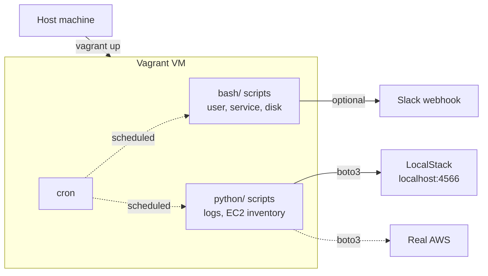

# sysadmin-toolkit

> Bash and Python automation scripts for everyday Linux sysadmin and DevOps tasks.
> Local Ubuntu VM via Vagrant + VirtualBox. Cloud scripts work against LocalStack
> or real AWS. Tested with pytest and moto.

[](./tests)
[](https://www.python.org/)
[](./LICENSE)

## What's in here

Six small but production-style automation scripts grouped by language. Every
script uses structured logging, proper argument parsing, and meaningful exit
codes — the boring fundamentals that turn a "tutorial script" into something
you'd actually run in production.

| Script | Purpose |
|---|---|
| `bash/user_manager.sh` | Create, delete, and list local users, with group assignment |
| `bash/service_monitor.sh` | Check a systemd service, alert to Slack, optionally auto-restart |
| `bash/disk_usage_alert.sh` | Warn when filesystems cross a usage threshold |
| `python/log_cleaner.py` | Archive log files older than N days (with gzip compression) |
| `python/log_parser.py` | Parse Nginx/Apache access logs — top IPs, URLs, status codes |
| `python/ec2_inventory.py` | List EC2 instances across regions (real AWS or LocalStack) |

## Architecture



The VM is the runtime. LocalStack runs on the host (or inside the VM) and
emulates the AWS API so the boto3 scripts work offline at zero cost.

## Quick start

```bash
# 1. Bring up the VM (VirtualBox by default — no paid software)
vagrant up
vagrant ssh
cd /vagrant
source /opt/toolkit-venv/bin/activate

# 2. Run a script
sudo ./bash/user_manager.sh create alice sudo
sudo ./bash/service_monitor.sh nginx

# 3. Run the tests
python3 -m pytest tests/ -v
```

Or with the Makefile:

```bash
make vm-up        # bring up the VM
make test         # run the tests
make localstack-up  # start LocalStack for ec2_inventory.py
```

## Usage examples

### user_manager.sh

```bash
$ sudo ./bash/user_manager.sh create alice sudo
2026-05-14T07:30:12+00:00 [INFO] created user 'alice' with home directory
2026-05-14T07:30:12+00:00 [INFO] added 'alice' to group 'sudo'

$ sudo ./bash/user_manager.sh list
alice                uid=1001 home=/home/alice shell=/bin/bash
```

### service_monitor.sh

```bash
$ sudo ./bash/service_monitor.sh nginx
2026-05-14T07:31:05+00:00 [INFO] service 'nginx' is active

$ SLACK_WEBHOOK_URL=https://hooks.slack.com/... \
    sudo ./bash/service_monitor.sh --restart nginx
# Auto-recovers if nginx is down, posts to Slack on both failure and recovery
```

### log_parser.py

```bash
$ python3 python/log_parser.py --log /var/log/nginx/access.log --top 5
Lines processed: 14523/14523

Top IPs:
       312  1.2.3.4
       287  5.6.7.8
       ...

Top URLs:
      4012  /api/v1/users
      3891  /index.html
      ...

Status codes:
  200: 13104
  404: 982
  500: 437
```

### ec2_inventory.py (against LocalStack)

```bash
$ make localstack-up
$ AWS_ENDPOINT_URL=http://localhost:4566 \
  AWS_ACCESS_KEY_ID=test AWS_SECRET_ACCESS_KEY=test \
  python3 python/ec2_inventory.py --regions us-east-1 --format json
```

## Scheduling with cron

Most of these are designed to run on a schedule. Example crontab:

```cron
# Check nginx every 5 minutes, auto-restart, alert to Slack
*/5 * * * * SLACK_WEBHOOK_URL=https://hooks.slack.com/... \
    /vagrant/bash/service_monitor.sh --restart nginx

# Disk usage check every 15 minutes
*/15 * * * * /vagrant/bash/disk_usage_alert.sh --threshold 85

# Archive old logs daily at 2am
0 2 * * * /vagrant/python/log_cleaner.py \
    --source /var/log/app --archive /var/log/app/archive --days 30
```

## Testing

24 tests covering the Python scripts, with moto mocking the AWS calls so the
tests run offline and never touch a real account.

```bash
$ python3 -m pytest tests/ -v
============================= test session starts ==============================
collected 24 items

tests/test_ec2_inventory.py::test_list_instances_returns_empty_when_no_instances PASSED
tests/test_ec2_inventory.py::test_list_instances_returns_running_instance PASSED
...
============================== 24 passed in 4.80s ==============================
```

## Project layout

```
sysadmin-toolkit/
├── Vagrantfile            # VirtualBox-based Ubuntu VM (free, cross-platform)
├── docker-compose.yml     # LocalStack for AWS emulation
├── Makefile               # vm-up, test, localstack-up, ...
├── requirements.txt
├── requirements-dev.txt
├── bash/
│   ├── user_manager.sh
│   ├── service_monitor.sh
│   └── disk_usage_alert.sh
├── python/
│   ├── log_cleaner.py
│   ├── log_parser.py
│   └── ec2_inventory.py
├── tests/
│   ├── test_log_cleaner.py
│   ├── test_log_parser.py
│   └── test_ec2_inventory.py
└── docs/
    ├── setup.md
    └── best-practices.md
```

## What I learned

A few things I'd carry forward into bigger DevOps work:

- **`set -euo pipefail` is non-negotiable** in any Bash script you'd schedule.
  Silent failures in cron are how you end up not noticing a service has been
  down for three days.
- **Exit codes matter.** Cron and monitoring systems read them. Returning `0`
  on partial failure is a lie that propagates.
- **Structured log lines** (ISO timestamp + level + message) cost nothing extra
  to write and make `grep`-based postmortems trivial.
- **LocalStack is the right learning environment** for boto3 — same code path,
  zero cost, zero risk of leaving an EC2 instance running over the weekend.
- **`moto` over LocalStack for unit tests.** Faster, no external service, runs
  in CI without Docker.
- **A README that opens with a diagram and a usage table** is read in 30
  seconds. A README that opens with "this script does X" is closed in 5.

## Requirements

- VirtualBox 7+ and Vagrant 2.4+ (free)
- Python 3.10+ on the host (only needed to run tests outside the VM)
- Docker (optional, only for LocalStack)

Apple Silicon users: VirtualBox now supports M1/M2 in beta, or use Multipass —
see [`docs/setup.md`](docs/setup.md).

## License

MIT — see [LICENSE](./LICENSE).
